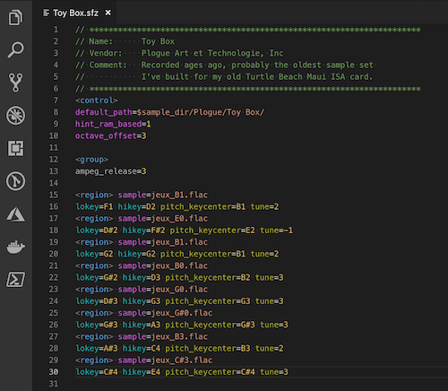

# vscode-sfz README

Provides [SFZ format][1] support for [Visual Studio Code][2].

## Features

1. Syntax highlighting for SFZ headers, opcodes, and settings
2. A theme ("Dark+ for SFZ") based on Dark+ for coloring SFZ-specific features
3. Parameter validation for most documented opcodes
4. Some snippets for creating and editing SFZ files

## Editing

- Syntax highlighting and parameter validation are handled by a set of
[TextMate Language Grammars][3] found in the *syntaxes/sfz.tmLanguage.json* file.
  - Opcode token definitions are organized by SFZ version ([v1][4], [v2][5],
    [ARIA][6] and [category][7] (e.g. Sound Source or Region Logic).
    To disable a group of patterns (e.g. ARIA-specific instrument setting opcodes),
    delete the corresponding #include line at the top of the tmLanguage file.
  - Parameter validations are organized by type (float, int, string) and range
    (for example, validation of floats between 0 and 100 is in the "float_0-100" object).
- Color assignments can be changed in the *themes/sfz.theme.json* file.
  For a guide, I used Simon Cann's [SFZTools for UltraEdit][8].
  Tokens defined specifically for this theme are at the top of the file.
- Snippets can be changed in the *snippets/sfz.json* file.

## Resources

- [The SFZ Format][1]
- [Visual Studio Code Language Extensions][9]
- [Visual Studio Code Themes][10]

## Known Issues

- Many modulation parameters are only evaluated as to whether they are numbers,
  rather than against valid ranges.
- Floats in scientific notation are not treated as valid.
- The effects `type` opcode is not validated as I can't find any documentation on it.
- `#define` substitutions are currently highlighted as invalid.

## Release Notes

### 0.1.0 2019-05-06
- Initial version.

[1]: https://sfzformat.com/
[2]: https://code.visualstudio.com/
[3]: https://macromates.com/manual/en/language_grammars
[4]: https://sfzformat.com/opcodes/?v=1
[5]: https://sfzformat.com/opcodes/?v=2
[6]: https://sfzformat.com/opcodes/?v=aria
[7]: https://sfzformat.com/misc/categories.html
[8]: https://noisesculpture.com/sfz-tools/
[9]: https://code.visualstudio.com/api/language-extensions/overview
[10]: https://code.visualstudio.com/api/extension-guides/color-theme
